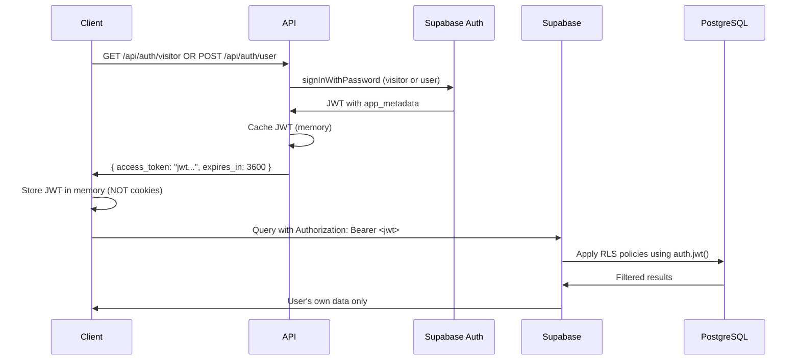

# Supabase Directory

This directory contains Supabase-related files following the standard Supabase project structure.

## Directory Structure

### `migrations/`

- **Purpose**: Stores SQL migration files that define changes to the database schema over time
- **Usage**: Used by Supabase CLI for database versioning and deployment
- **File Naming**: Migration files are typically named with timestamps (e.g., `20231109120000_create_users_table.sql`)
- **CLI Commands**:
  - `supabase db diff` - Generate new migration files
  - `supabase db reset` - Reset database and apply all migrations
  - `supabase db push` - Apply migrations to remote database

### Other Standard Supabase Files/Folders

- `functions/` - Supabase Edge Functions (serverless functions)
- `seed.sql` - Initial data seeding for the database
- `config.toml` - Supabase project configuration file

## Database Management

### Current State

The `migrations/` folder is currently empty, which suggests:

- Database schema is managed through the Supabase Dashboard
- No custom migrations have been created yet
- Schema changes are handled differently in this project

### Creating Migrations

To create and manage database migrations:

1. **Generate a migration from schema changes**:

   ```bash
   supabase db diff --file migration_name
   ```

2. **Create a new migration manually**:

   ```bash
   supabase migration new migration_name
   ```

3. **Apply migrations locally**:

   ```bash
   supabase db reset
   ```

4. **Push migrations to production**:
   ```bash
   supabase db push
   ```

## Best Practices

- Always create migrations for schema changes rather than modifying the database directly
- Use descriptive names for migration files
- Test migrations locally before pushing to production
- Keep migrations atomic and reversible when possible
- Version control all migration files

## Client-Side Query Best Practices

When querying RLS-protected tables from the client side, follow these guidelines for optimal performance and code clarity.

### 🔐 Security vs Performance

Both approaches are **equally secure** due to Row Level Security (RLS), but differ in performance:

```typescript
// Option 1: SELECT * (secure but less performant)
const { data } = await client.from('song_library').select('*');

// Option 2: SELECT with explicit user_id (secure AND performant)
const { data } = await client.from('song_library')
  .select('*')
  .eq('user_id', currentUserId);
```

### ✅ Recommended Approach

**Always use explicit user_id conditions** for these benefits:

#### **1. Performance Benefits**

- Leverages database indexes for faster queries
- Reduces table scan operations
- Better performance as datasets grow
- Query planner can optimize execution path

#### **2. Code Clarity**

- Makes security intent explicit
- Self-documenting data access patterns
- Easier for developers to understand

#### **3. Consistent Patterns**

- Matches patterns in other private tables
- Follows database best practices
- Reduces cognitive load

### 📝 Implementation Examples

#### **Regular Queries:**

```typescript
// ✅ RECOMMENDED: Get user's library entries
const getUserLibrary = async (userId: string) => {
	const { data, error } = await client
		.from("song_library")
		.select(
			`
      user_id,
      song_id,
      song_owner_id,
      created_at,
      song:song_id (
        song_name,
        song_slug
      )
    `,
		)
		.eq("user_id", userId)
		.order("created_at", { ascending: false });

	return { data, error };
};
```

#### **Realtime Subscriptions:**

```typescript
// ✅ RECOMMENDED: Subscribe with explicit filter
const subscribeToSongLibrary = (userId: string, callback: Function) => {
	return client
		.channel(`song_library:user_id=eq.${userId}`)
		.on(
			"postgres_changes",
			{
				event: "*",
				schema: "public",
				table: "song_library",
				filter: `user_id=eq.${userId}`, // Explicit filter
			},
			callback,
		)
		.subscribe();
};
```

#### **Existence Checks:**

```typescript
// ✅ RECOMMENDED: Check if song is in user's library
const isInSongLibrary = async (userId: string, songId: string) => {
	const { data, error } = await client
		.from("song_library")
		.select("song_id")
		.eq("user_id", userId)
		.eq("song_id", songId)
		.single();

	return { exists: !!data, error };
};
```

### 🛡️ Security Reminder

Remember: **RLS is your security layer**, explicit conditions are for performance:

```typescript
// Even malicious attempts are blocked by RLS:
await client
	.from("song_library")
	.select("*")
	.eq("user_id", "someone-elses-user-id"); // ❌ Returns no rows

// RLS automatically transforms queries to:
// SELECT * FROM song_library
// WHERE user_id = 'someone-elses-user-id'
// AND user_id = 'current-users-id'  -- Added by RLS
// Result: No unauthorized data access
```

### ⚡ Performance at Scale

As tables grow larger:

- **Without explicit conditions**: Full table scans with RLS filtering
- **With explicit conditions**: Direct index lookups + RLS validation
- **Result**: Significant performance improvement

### 🎯 Key Takeaway

**Always include explicit `user_id` conditions** in client-side queries for private tables. This provides performance optimization while RLS ensures security.

## 🔐 Comprehensive JWT & RLS Security Analysis

### **Authentication Architecture Overview**

SongShare implements a sophisticated dual authentication system with two distinct JWT flows:

1. **Supabase JWT Tokens** - For database access via RLS policies
2. **Session JWT Cookies** - For application-level authentication

### **🔄 JWT Token Flow Analysis**

#### **Flow 1: Supabase Database Access (RLS)**



**Security Characteristics:**

- **Storage**: In-memory JavaScript variables only (no localStorage/cookies)
- **Transport**: HTTPS + Authorization headers
- **Expiration**: 1-hour automatic expiry
- **Scope**: Database access only
- **RLS Enforcement**: PostgreSQL-level filtering

#### **Flow 2: Session Authentication (App-Level)**

```mermaid
sequenceDiagram
    User->>Browser: Click "Sign in with OAuth"
    Browser->>API: GET /api/oauth/signin
    API->>Browser: Set CSRF cookie + redirect to OAuth provider
    Browser->>OAuth Provider: Complete authorization
    OAuth Provider->>API: POST /api/oauth/callback with code
    API->>API: Verify CSRF + exchange code for user data
    API->>Browser: Set-Cookie: userSession=<jwt>; HttpOnly; Secure; SameSite=Lax
    Browser->>Client: Redirect to dashboard?justSignedIn=1
    Client->>API: GET /api/me (credentials: include)
    API->>Client: 200 { userSessionData }
    Client->>Client: Update Zustand store (isSignedIn=true)
```

**Security Characteristics:**

- **Storage**: HttpOnly cookies (cannot be accessed by JavaScript)
- **Transport**: Automatic cookie attachment by browser
- **Expiration**: 7-day sessions with server-side validation
- **Scope**: Application-level authentication
- **CSRF Protection**: Double-submit token pattern

### **🛡️ JWT Security Implementation Details**

#### **1. JWT Structure & Validation**

**Visitor Tokens:**

```json
{
	"sub": "visitor-user-uuid",
	"app_metadata": {
		"visitor_id": "visitor-user-uuid"
	},
	"iat": 1699564800,
	"exp": 1699568400
}
```

**User Tokens:**

```json
{
	"sub": "actual-user-uuid",
	"app_metadata": {
		"user": {
			"user_id": "actual-user-uuid"
		}
	},
	"iat": 1699564800,
	"exp": 1699568400
}
```

#### **2. RLS Policy Security Analysis**

**How RLS Enforcement Works:**

```sql
-- Every query automatically becomes:
SELECT * FROM song_library
WHERE user_id = ((auth.jwt() -> 'app_metadata' -> 'user' ->> 'user_id'))::uuid
-- This is added by PostgreSQL BEFORE any client conditions
```

**Security Guarantees:**

- ✅ **Database-level enforcement** (cannot be bypassed by client code)
- ✅ **Automatic filtering** on every query
- ✅ **Cross-user isolation** (User A cannot see User B's data)
- ✅ **No visitor access** to private tables (no visitor_id policies exist)

#### **3. Token Setting & Transmission Security**

**Supabase JWT Setting Process:**

```typescript
// 1. Client requests token
const response = await fetch(`${API_BASE_URL}/api/auth/visitor`);
const { access_token } = await response.json();

// 2. Store in memory (secure)
let cachedToken = access_token; // Not in cookies!

// 3. Create Supabase client with JWT
const client = createClient(url, anonKey, {
	global: {
		headers: {
			Authorization: `Bearer ${access_token}`, // HTTPS only
		},
	},
});

// 4. Set for WebSocket connections
client.realtime.setAuth(access_token);
```

**Session Cookie Setting Process:**

```typescript
// Server-side (OAuth callback)
const sessionJwt = await buildUserSessionJwt(userData);
const cookieHeader = buildSessionCookie({
	name: "userSession",
	value: sessionJwt,
	opts: {
		maxAge: 604800, // 7 days
		httpOnly: true, // Cannot be read by JavaScript
		secure: isProd, // HTTPS in production
		sameSite: "Lax", // CSRF protection
	},
});
response.headers.append("Set-Cookie", cookieHeader);
```

### **🔒 Cookie Security Analysis**

#### **HttpOnly Session Cookies**

**Security Properties:**

- ✅ **JavaScript Isolation**: `httpOnly: true` prevents XSS access
- ✅ **HTTPS Enforcement**: `secure: true` in production
- ✅ **CSRF Protection**: `sameSite: Lax` prevents cross-site requests
- ✅ **Automatic Transmission**: Browser handles cookie attachment
- ✅ **Server-Only Validation**: Only `/api/me` can read session data

**Cookie Attributes Analysis:**

```http
Set-Cookie: userSession=<jwt>;
  HttpOnly;           # Prevents XSS attacks
  Secure;             # HTTPS only (production)
  SameSite=Lax;       # CSRF protection
  Path=/;             # Available to all routes
  Max-Age=604800;     # 7-day expiration
```

#### **Attack Vector Mitigation**

**❌ XSS Attacks:**

- Supabase JWTs: Stored in memory, cleared on page reload
- Session cookies: HttpOnly prevents JavaScript access
- Result: Even if XSS occurs, tokens cannot be stolen

**❌ CSRF Attacks:**

- OAuth flow: Double-submit CSRF token verification
- Session cookies: SameSite=Lax prevents cross-origin requests
- API calls: CORS restrictions limit allowed origins

**❌ Token Hijacking:**

- Short expiration: Supabase JWTs expire in 1 hour
- Automatic refresh: Invalid tokens trigger re-authentication
- Isolated scope: Each token only accesses specific user's data

### **🚀 Real-time Subscription Security**

#### **WebSocket Authentication Flow**

```typescript
// 1. Get authenticated client
const client = await getSupabaseClientWithAuth();

// 2. JWT automatically attached to WebSocket
client.realtime.setAuth(supabaseJwt); // Called automatically

// 3. Subscribe with RLS enforcement
const subscription = client
	.channel(`song_library:user_id=eq.${userId}`)
	.on(
		"postgres_changes",
		{
			event: "*",
			table: "song_library",
			filter: `user_id=eq.${userId}`, // Additional client filter
		},
		handleChange,
	)
	.subscribe();

// 4. Database applies RLS to subscription events
// User only receives events for their own records
```

**Security Guarantees:**

- ✅ **Authenticated connections**: WebSocket uses same JWT as queries
- ✅ **Event filtering**: RLS applied to realtime events
- ✅ **User isolation**: Only receive events for accessible records
- ✅ **Automatic cleanup**: Subscriptions closed when tokens expire

### **🔍 Step-by-Step JWT Setting Process**

#### **Scenario 1: Anonymous Visitor**

1. **Page Load**:

   ```typescript
   const client = await getSupabaseClientWithAuth();
   ```

2. **Token Request**:

   ```typescript
   // Internal call to /api/auth/visitor
   const visitorToken = await getSupabaseClientToken();
   ```

3. **Server Token Generation**:

   ```typescript
   // Server signs in shared visitor user
   const { data } = await supabaseAdmin.auth.signInWithPassword({
     email: VISITOR_EMAIL,
     password: VISITOR_PASSWORD
   });
   return data.session.access_token; // Real Supabase JWT
   ```

4. **Client Storage**:

   ```typescript
   cachedSupabaseClientToken = visitorToken; // Memory only
   ```

5. **Database Access**:
   ```sql
   -- RLS allows visitor access to *_public tables only
   auth.jwt() -> 'app_metadata' ->> 'visitor_id' IS NOT NULL
   ```

#### **Scenario 2: Authenticated User**

1. **OAuth Sign-in**:

   ```typescript
   // User clicks sign-in, completes OAuth flow
   // Server sets HttpOnly session cookie
   ```

2. **Page Load After OAuth**:

   ```typescript
   // Client detects justSignedIn=1 parameter
   await ensureSignedIn({ force: true }); // Force refresh
   ```

3. **Session Validation**:

   ```typescript
   // GET /api/me with HttpOnly cookie
   const response = await fetch("/api/me", { credentials: "include" });
   const userData = await response.json();
   ```

4. **Supabase Token Request**:

   ```typescript
   // POST /api/auth/user with user credentials
   const userToken = await signInUser(email, password);
   ```

5. **Server User Token Generation**:

   ```typescript
   // Server signs in actual user
   const { data } = await supabaseAdmin.auth.signInWithPassword({
     email: userEmail,
     password: userPassword
   });
   // Ensures app_metadata.user.user_id is set for RLS
   return data.session.access_token;
   ```

6. **Client Storage**:

   ```typescript
   cachedUserToken = userToken; // Memory only, replaces visitor token
   ```

7. **Database Access**:
   ```sql
   -- RLS allows user access to own private data + all public data
   user_id = ((auth.jwt() -> 'app_metadata' -> 'user' ->> 'user_id'))::uuid
   ```

### **🎯 Security Audit Results**

**✅ SECURE: Multi-layer Protection**

1. **Transport Layer**: HTTPS encryption for all JWT transmission
2. **Storage Layer**: In-memory tokens + HttpOnly cookies
3. **Database Layer**: PostgreSQL RLS enforcement
4. **Application Layer**: CSRF protection + CORS restrictions

**✅ SECURE: Token Isolation**

- Supabase JWTs: Database access only, short-lived (1 hour)
- Session cookies: App authentication only, longer-lived (7 days)
- No token reuse between contexts

**✅ SECURE: User Isolation**

- Each user gets unique JWTs with their user_id
- RLS policies automatically filter all queries
- Cross-user data access is impossible at database level

**✅ SECURE: Attack Mitigation**

- XSS: HttpOnly cookies + in-memory tokens
- CSRF: SameSite attributes + double-submit tokens
- Token theft: Short expiration + automatic refresh

### **⚡ Performance Optimizations**

**Token Caching Strategy:**

- Server-side: Cache tokens until expiry (reduces auth operations)
- Client-side: Memory cache prevents redundant API calls
- Automatic cleanup: Expired tokens removed from cache

**Database Optimization:**

- Explicit user_id conditions leverage indexes
- RLS policies use indexed columns for fast filtering
- Connection pooling handled by Supabase

**Real-time Efficiency:**

- Single WebSocket connection per client
- Event filtering at database level
- Subscription cleanup on token expiry

The authentication system provides enterprise-grade security with proper separation of concerns, defense in depth, and optimal performance characteristics.

## Documentation

For more information about Supabase migrations and database management, see:

- [Supabase CLI Documentation](https://supabase.com/docs/reference/cli)
- [Database Migrations Guide](https://supabase.com/docs/guides/cli/local-development#database-migrations)
